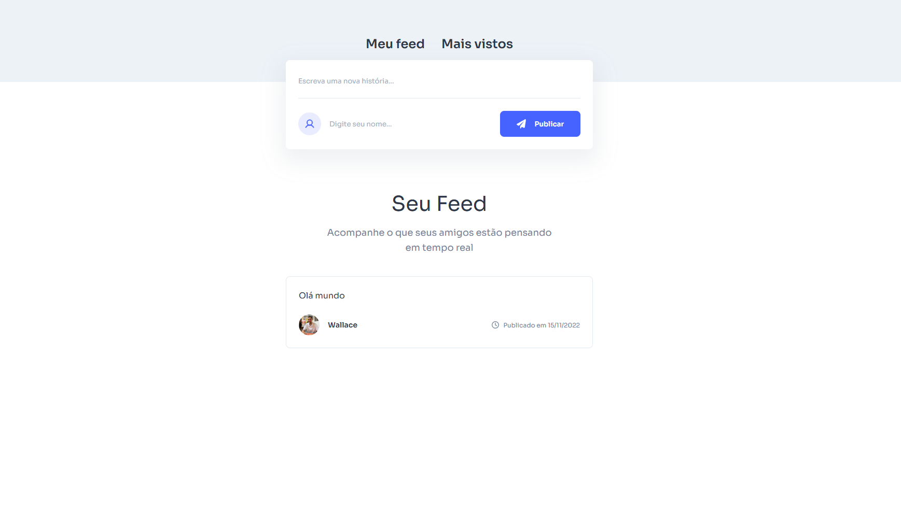

# Rede Social Simples

Este é um projeto de uma rede social simples, desenvolvido com React. Ele permite que os usuários publiquem histórias, visualizem um feed de postagens e acompanhem os posts mais visualizados.



## Funcionalidades

- **Publicar histórias**: Os usuários podem escrever e publicar novas histórias.
- **Feed de postagens**: Exibe as histórias publicadas pelos usuários.
- **Mais visualizados**: Página dedicada para exibir os posts mais visualizados.
- **Responsividade**: O layout é adaptado para diferentes tamanhos de tela.

## Tecnologias Utilizadas

- **React**: Biblioteca JavaScript para construção de interfaces de usuário.
- **React Router**: Gerenciamento de rotas no frontend.
- **CSS**: Estilização do projeto com arquivos CSS modulares.
- **LocalStorage**: Armazenamento local para persistência de dados.

## Estrutura do Projeto

src/
├── components/
│ ├── Feed.js
│ ├── FeedStatus.js
│ ├── PostForm.js
├── config/
│ └── errors.js
├── images/
│ ├── clock.svg
│ ├── cloud-error.svg
│ ├── empty-folder.svg
│ ├── loader-primary.svg
│ ├── loader-white.svg
│ ├── paper-plane.svg
│ ├── reload.svg
│ └── user.svg
├── mocks/
│ └── posts.json
├── pages/
│ ├── Home.js
│ └── MostViewed.js
├── services/
│ └── postsServices.js
├── styles/
│ ├── App.css
│ ├── Feed.css
│ ├── PostForm.css
│ └── global.css
├── App.js
├── Routes.js
├── index.js

## Como Executar o Projeto

1. **Clone o repositório**:
```bash
  git clone <url-do-repositorio>
  cd socialmedia
```
2. Instale as dependências:
```bash
  npm install
```
3. Inicie o servidor de desenvolvimento:
```bash
  npm start
```
4. Acesse no navegador: Abra http://localhost:3000 para visualizar o projeto.

## Scripts Disponíveis

- npm start: Inicia o servidor de desenvolvimento.
- npm run build: Gera uma versão otimizada para produção.
- npm test: Executa os testes configurados.
- npm run eject: Ejetar a configuração padrão do Create React App.

## Estrutura de Estilos

Os estilos estão organizados em arquivos CSS modulares dentro da pasta src/styles. O arquivo global.css contém estilos globais e variáveis CSS.

## Licença

Este projeto é apenas para fins educacionais e não possui uma licença específica.

[Wallace Vieira](https://wallacevieira.vercel.app)  
Desenvolvedor Fullstack e gamer.